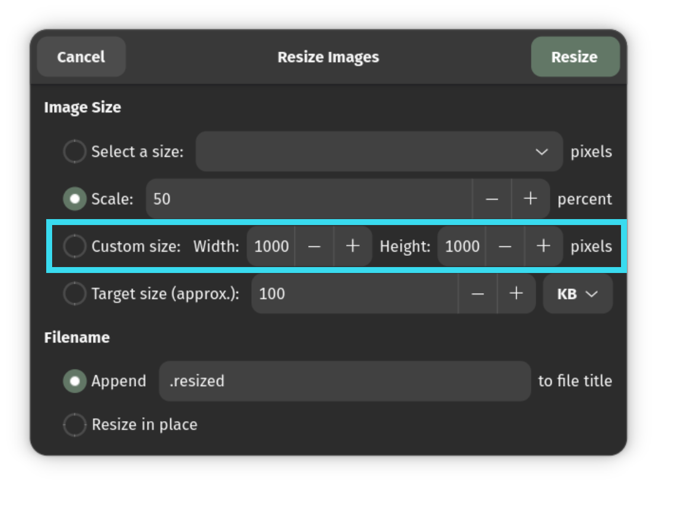
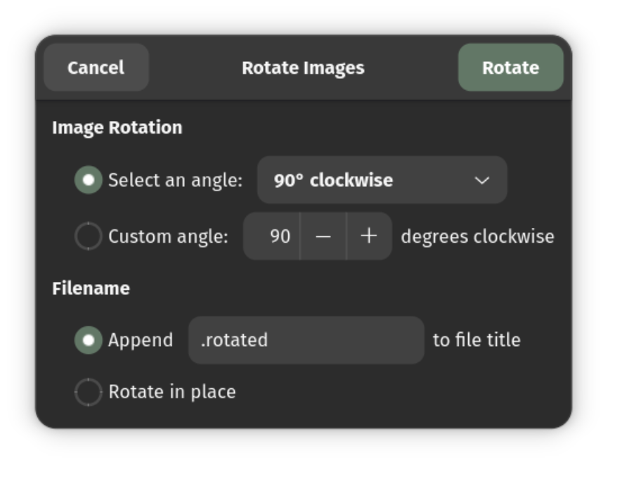

# Nautilus Image Converter (Enhanced)

The **Nautilus-Image-Converter** extension allows you to resize and rotate images directly from the right-click context menu in the Nautilus (GNOME Files) file manager.

This repository is an enhanced fork of the original extension, featuring new improvements to make image manipulation even easier for modern workflows.

## ✨ New in this Fork
* **Target File Size Compression:** You can now compress and resize images to match a specific target file size (e.g., 500KB, 2MB). This is perfect for optimizing images for web uploads, email attachments, or strict size limits without having to guess the correct quality settings.


## Core Features (from Original Project)

All the original features of the `nautilus-image-converter` are fully intact:

* **Resize by Scale:** Scale images by a percentage (e.g., 50%).
* **Resize by Custom Size:** Set a specific pixel width and height.
* **Rotate Images:** Rotate 90°, 180°, or by a custom angle.
* **In-Place or New File:** Choose to overwrite your original images or create new copies (e.g., `image.resized.jpg`).

  
 


## 📥 Installation

To build and install the extension from source, run the following commands:

```bash
# 1. Install dependencies (Ubuntu/Debian example)
sudo apt install libgtk-4-dev libnautilus-extension4 libnautilus-extension-dev gettext jpegoptim meson ninja-build

# 2. Clone this repository
git clone https://github.com/Ameen-Sha-Cheerangan/nautilus-image-converter.git
cd nautilus-image-converter

# 3. Build the project
meson build
ninja -C build

# 4. Install
sudo ninja install -C build
```

**Important:** Once installed, you must completely restart Nautilus to see the extension in your context menu:
```bash
nautilus -q
```

## 🗑️ Uninstallation

Navigate to your project directory (`nautilus-image-converter`) where you built the project:

```bash
cd nautilus-image-converter
sudo ninja uninstall -C build
```

## 🕰️ Older GNOME Versions (GNOME < 43)

Are you using an older version of GNOME (e.g., Ubuntu 22.04 or earlier)? This repository requires GNOME 43+ and GTK4. 

For older systems, please use the **[Legacy Version](https://github.com/Ameen-Sha-Cheerangan/nautilus-image-converter-legacy)** which also includes the new Target File Size feature!

## 🤝 Contributing

Patches, bug reports, and feature requests are always welcome! Feel free to open an Issue or a Pull Request on this repository.

## ⭐ Show Your Support

If you found this extension helpful, please consider giving this repository a star on GitHub! It helps others find the project.


## ☕ Support the Developer

If this tool helped you, consider supporting its developer!

### 🌐 International Users
You can support me instantly via **Ko-fi**.

<a href="https://ko-fi.com/ameen_sha" target="_blank">
  
</a>

### 🇮🇳 Users in India (UPI)
You can support directly via any UPI app (GPay, PhonePe, Paytm) using the QR code or ID below:

<div align="center">
  
  <br/>
  <b>UPI ID:</b> <code>ameenshahcheerangan-1@okicici</code>
</div>

<br/>

> **📱 Viewing on mobile?** 
> * **Direct Link:** [Click here to open your UPI app](https://upi.pe/ameenshahcheerangan-1@okicici?pn=Ameen+Sha+C)
> * **Manual Scan:** Take a screenshot of the QR code above and upload it directly inside your UPI app (GPay, PhonePe, Paytm, etc.).

## 📜 Credits & Acknowledgments

This project is a fork of the original [nautilus-image-converter](https://gitlab.gnome.org/coreyberla/nautilus-image-converter). Huge thanks to **Corey Berla** and all previous contributors for building the fantastic foundation of this tool!
